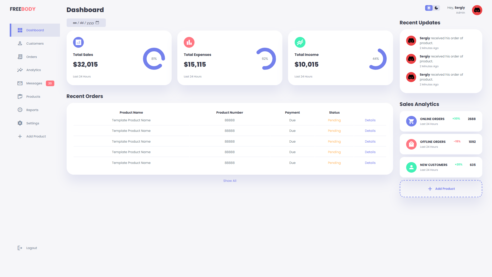
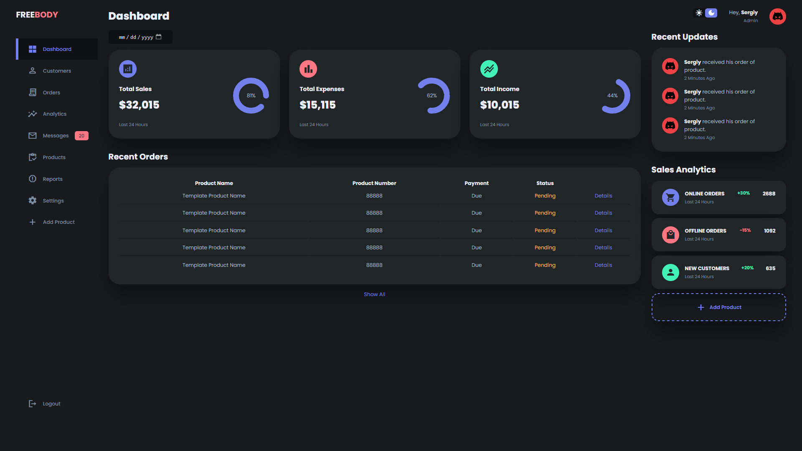

# Admin Dashboard with Dark Mode

More images can be viewed in the `images` folder.

### Built With

![HTML][html]
![CSS][css]
![JS][js]

## Installation

1. Clone the project
2. Go to the project root directory
3. Open `index.html` in browser

[html]: https://img.shields.io/badge/HTML-ff560f?style=for-the-badge&logo=html5&logoColor=white
[css]: https://img.shields.io/badge/CSS-414df7?style=for-the-badge&logo=css3&logoColor=white
[js]: https://img.shields.io/badge/JavaScript-ead41c?style=for-the-badge&logo=javascript&logoColor=black